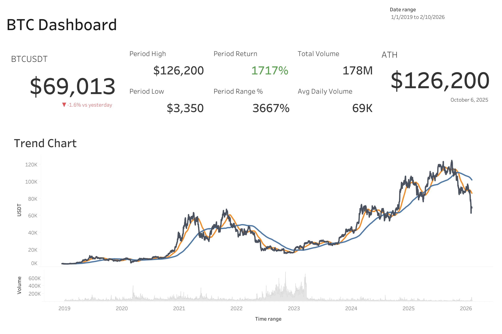

# BTC Market Data Analysis Project
by Dat Kiang

## Overview

This project demonstrates a clean quantitative research workflow on BTC daily data, from feature engineering and signal design to vectorized backtesting with transaction cost modeling, with a focus on research methodology, reproducibility, and honest evaluation against a Buy & Hold benchmark.

A Tableau dashboard is also included to visualize key market metrics such as price trends, trading volume, and market behavior.

The goal is to show how a signal behaves after realistic trading frictions, not to optimize or overfit performance.

The repository includes a **fixed BTC daily data snapshot** (data/btc_daily.csv) for reproducibility.

## What this project does

- Load & clean BTC daily data
- Build features: returns, momentum, volatility
- Design a simple **long/flat** signal (momentum + volatility filter)
- Run a **vectorized backtest** with:
  - Gross vs Net returns
  - Transaction costs (fees + slippage in bps)
  - Turnover and trade count diagnostics
  - Equity curve, Total return, Sharpe ratio, Max Drawdown
- Evaluate in-sample vs out-of-sample performance
- Perform regime analysis (Bull vs Bear using MA200)
- Compare performance with **Buy & Hold**
- Build an interactive Tableau dashboard to visualize BTC price trends and trading activity

---

## Project Structure

```text
quant-mini-project/
├── run.py
├── sql/
│   └── market_data_eda.sql	# market data research queries in Postgres (returns/vol/regime)
├── data/
│   └── btc_daily.csv
├── images/
│   └── btc_dashboard.png	# Tableau dashboard screenshot
└── src/
    ├── data_loader.py
    ├── features.py
    ├── signals.py
    └── backtest.py
```

---

## How to run

```bash
pip install numpy pandas matplotlib requests

# Optional: regenerate data
python src/data_loader.py

# Run research & backtest
python run.py
```
---

## SQL (Postgres)

This repo also includes sql/market_data_eda.sql, which contains SQL queries for basic market data diagnostics: daily returns, rolling volatility (window functions), monthly returns, and a simple MA200 bull/bear regime split.

---

## Example Results (current sample)

**Strategy (Momentum + Vol filter)**

- **Train:**
  - Total return (net): ~ +182%
  - Sharpe (net): ~ 0.91
  - Max drawdown (net): ~ -35%
  - Avg turnover: ~ 0.10
- **Test (OOS):**
  - Total return (net): ~ +17%
  - Sharpe (net): ~ 0.41
  - Max drawdown (net): ~ -29%
  - Avg turnover: ~ 0.13

**Buy & Hold (Net)**
- **Train:** Total return ~ +1060%, Sharpe ~ 1.07
- **Test (OOS):** Total return ~ +56%, Sharpe ~ 0.67

**Regime Analysis (Strategy, Net, MA200)**
- Bull total return: ~ +236%, Sharpe ~ 1.21
- Bear total return: ~ -1.5%, Sharpe ~ 0.11

**Key Observations**
- Performance degrades out-of-sample, indicating limited robustness.
- Transaction costs materially reduce returns due to relatively high turnover.
- Returns are concentrated in bull regimes; performance in bear regimes is close to flat.
- Buy & Hold dominates during extended bull markets, while the strategy captures only a limited fraction of the upside.

---

## Tableau Dashboard – Market Exploration

A Tableau dashboard was created to explore BTC market behavior visually and complement the quantitative research workflow.

### Dashboard Preview



**Live Dashboard:**  https://public.tableau.com/app/profile/dat.kiang/viz/Book1_17731725954590/Dashboard1?publish=yes&showOnboarding=true

The dashboard focuses on three aspects:

### 1. Market Overview
The price chart shows long-term BTC trends and major market cycles.

### 2. Market Activity
Volume data highlights periods of increased trading activity, often coinciding with major price movements.

### 3. Market Behavior
The visual patterns in price and volume help explain why momentum-based signals may work during strong trending markets but struggle during sideways periods.

This dashboard acts as a visual exploration layer complementing the quantitative research pipeline implemented in Python.

---

## Scope and Limitations

- Single-asset (BTC), long/flat only
- No position sizing or portfolio construction
- No portfolio-level risk management

## Possible Extensions

- Position sizing / volatility targeting
- Turnover reduction and signal smoothing
- Multi-asset backtesting
- Parameter sensitivity / stability analysis